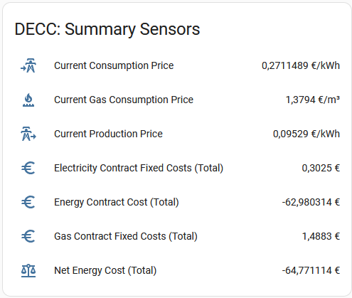
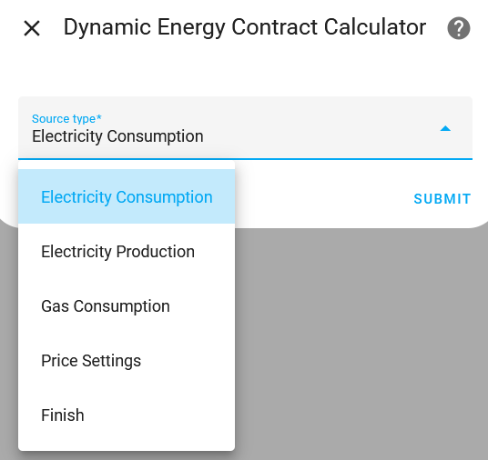
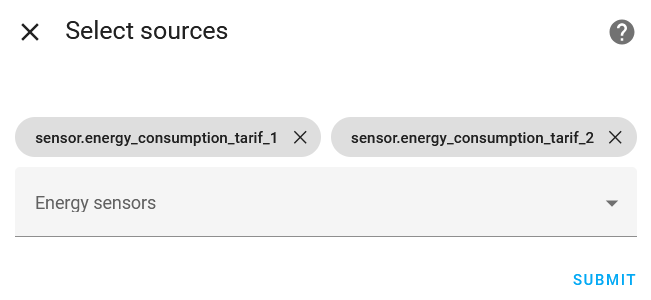
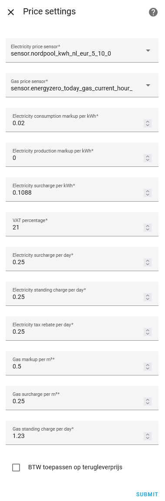
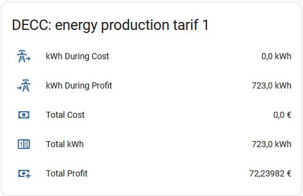

# Dynamic Energy Contract Calculator

This Home Assistant custom integration adds utility sensors that calculate electricity or gas costs using current pricing information. It can track consumption or production and provides several helpers to manage the sensors.



## Installation

1. **Via [HACS](https://hacs.xyz/):**
   - Add this repository as a custom integration in HACS.
   - Install **Dynamic Energy Contract Calculator** from the HACS list of integrations.
   - Restart Home Assistant to load the integration.

2. **Manual installation:**
   - Copy the `dynamic_energy_contract_calculator` folder from `custom_components` into your Home Assistant `custom_components` directory.
   - Restart Home Assistant.

## Configuration

1. In Home Assistant navigate to **Settings → Devices & Services** and use **Add Integration**.
2. Search for **Dynamic Energy Contract Calculator** and follow the setup flow.
3. Select the energy sensors you want to track and provide optional price sensors for live pricing.
   Values from multiple price sensors are added together, allowing you to keep separate sensors
   for things like dynamic tariff surcharges.
4. Optionally configure price settings such as markup and tax values.

Price settings can be changed later from the integration's options flow. See
the *Price Settings* section below for all available keys.

### Installation parameters

During setup you will be asked for the following information:

1. **Source type** – choose whether the selected sensors measure electricity
   consumption, electricity production or gas consumption.
2. **Energy sensors** – one or more sensors with the `energy` or `gas` device
   class that provide cumulative readings.
3. **Price sensors** – optional sensors that provide components of the current energy price
   in €/kWh or €/m³. You can select more than one; their values are summed.
   This makes it possible to add sensors that expose dynamic tariff surcharges.
4. **Price settings** – values from the table below used to calculate the final
   price.

See the [Home Assistant configuration documentation](https://www.home-assistant.io/docs/configuration/integrations/) for general details on adding custom integrations.

## Provided Sensors

For each configured source the integration creates the following sensors:

- `..._kwh_total` – total energy used/produced in kWh
- `..._cost_total` – accumulated cost in euro
- `..._profit_total` – accumulated profit in euro
- `..._kwh_during_cost_total` – kWh measured when the price is positive
- `..._kwh_during_profit_total` – kWh measured when the price is negative

In addition a few summary sensors are created:

- `sensor.electricity_contract_fixed_costs_total`
- `sensor.gas_contract_fixed_costs_total`
- `sensor.net_energy_cost_total`
- `sensor.energy_contract_cost_total`
- `sensor.current_consumption_price`
- `sensor.current_production_price`
- `sensor.current_gas_consumption_price`

These sensors can be used in the [Energy dashboard](https://www.home-assistant.io/docs/energy/) or in your own automations.

## Services

The integration exposes several services under the `dynamic_energy_contract_calculator` domain:

- `reset_all_meters` – reset all dynamic energy sensors to `0`
- `reset_selected_meters` – reset only the specified sensors
- `set_meter_value` – manually set the value of a sensor


Each service is documented in Home Assistant once the integration is installed. See the [service documentation](https://www.home-assistant.io/docs/scripts/service-calls/) for details on calling services.

## Supported Devices / Functions

The integration works with any energy or gas sensor that provides cumulative kWh or m³ readings. A price sensor is optional but allows for true dynamic pricing. Available services are:

- `reset_all_meters`
- `reset_selected_meters`
- `set_meter_value`

## Usage

Add the created sensors to your dashboards or use them in automations to keep
track of real-time energy costs. The integration provides several services (see
the *Services* section below) that can be called from automations or scripts to
reset meters or manually set a value.

## Use Cases

- Monitor day-to-day electricity and gas costs in the Energy dashboard.
- Compare consumption and production prices to determine when selling back to the grid is profitable.
- Combine the summary sensors in automations to keep track of monthly spending or trigger notifications when costs rise above a threshold.

## Examples

### Notify when daily cost exceeds €5

```yaml
alias: "Notify high daily cost"
trigger:
  - platform: numeric_state
    entity_id: sensor.energy_contract_cost_total
    above: 5
action:
  - service: notify.mobile_app_phone
    data:
      message: "Your energy usage exceeded €5 today."
```

### Reset all meters on the first day of the month

```yaml
alias: "Monthly meter reset"
trigger:
  - platform: time
    at: "00:00:00"
condition:
  - condition: template
    value_template: "{{ now().day == 1 }}"
action:
  - service: dynamic_energy_contract_calculator.reset_all_meters
```

## Price Settings

During configuration you can adjust several price related options. These values
are split into costs per kWh/m³ or per day and are further divided by
government, grid operator and supplier charges. All values are added on top of
the base price from your price sensor before VAT is calculated.

| Setting | Description |
| ------- | ----------- |
| `per_unit_supplier_electricity_markup` | Additional cost per kWh for electricity consumption. |
| `per_unit_supplier_electricity_production_markup` | Additional revenue per kWh for produced electricity. |
| `per_unit_government_electricity_tax` | Government tax per kWh for consumption. |
| `per_day_grid_operator_electricity_connection_fee` | Daily electricity network fees. |
| `per_day_supplier_electricity_standing_charge` | Fixed daily cost charged by your supplier. |
| `per_day_government_electricity_tax_rebate` | Daily rebate applied to reduce fixed costs. |
| `per_unit_supplier_gas_markup` | Additional cost per cubic meter of gas. |
| `per_unit_government_gas_tax` | Government tax per cubic meter of gas. |
| `per_day_grid_operator_gas_connection_fee` | Daily gas connection fees. |
| `per_day_supplier_gas_standing_charge` | Fixed daily gas contract cost. |
| `vat_percentage` | VAT rate that should be applied to all calculated prices. |
| `production_price_include_vat` | Apply VAT to production price (up to break-even). Default: `true`. |
| `netting_enabled` | Enable netting (salderingsregeling) for energy tax credits. Default: `false`. |
| `overage_compensation_enabled` | Limit production markup to break-even; use only spot price for surplus. Default: `false`. |
| `overage_compensation_rate` | Additional reduction from spot price for surplus energy per kWh. |
| `surplus_vat_enabled` | Apply VAT to surplus energy compensation. Default: `false`. |
| `production_bonus_percentage` | Percentage bonus on all production (e.g., 10 for Zonneplan's 10% extra). Default: `0`. |
| `negative_price_production_bonus_percentage` | Percentage bonus when spot price is negative (e.g., 15 for Frank Energie). Default: `0`. |

If your price sensors already provide prices **including** VAT, set
`vat_percentage` to `0` to avoid double counting.

### Configuration parameters

All of the parameters above can be changed later from the integration's options
flow. You can also modify the list of energy sensors or change the selected
price sensor at any time via **Settings → Devices & Services**.

## How Calculations Work

For every update of an energy sensor the integration calculates the change
since the previous update. This delta is multiplied by a price that depends on
the selected source type and the configured price settings.

### Consumption

Electricity consumption uses the formula:

```
price = (
    base_price
    + per_unit_supplier_electricity_markup
    + per_unit_government_electricity_tax
) * (1 + vat_percentage / 100)
```

Gas consumption uses:

```
price = (
    base_price
    + per_unit_supplier_gas_markup
    + per_unit_government_gas_tax
) * (1 + vat_percentage / 100)
```

### Production

For production sensors the supplier markup is subtracted. Depending on the
`production_price_include_vat` option VAT may or may not be applied:

```
if production_price_include_vat:
    price = (
        base_price
        - per_unit_supplier_electricity_production_markup
    ) * (1 + vat_percentage / 100)
else:
    price = base_price - per_unit_supplier_electricity_production_markup
```

The resulting price is multiplied by the energy delta (kWh or m³) and added to
the appropriate cost or profit sensor.

### Daily costs

Once per day at midnight fixed contract costs are added:

```
electricity_daily = (
    per_day_grid_operator_electricity_connection_fee
    + per_day_supplier_electricity_standing_charge
    - per_day_government_electricity_tax_rebate
) * (1 + vat_percentage / 100)

gas_daily = (
    per_day_grid_operator_gas_connection_fee
    + per_day_supplier_gas_standing_charge
) * (1 + vat_percentage / 100)
```

## Data Update

Dynamic sensors update whenever the linked energy sensor or price sensor changes. The integration listens for state changes, so updates happen immediately without polling. Daily cost sensors add their values at midnight using Home Assistant's scheduler.

## Troubleshooting

- **No sensors created:** check the Home Assistant logs for setup errors and
  verify that your energy sensors are selected during configuration.
- **Prices remain at 0:** ensure a valid price sensor is configured or manually
  set one in the options flow.
- **Resetting values:** use the `reset_all_meters` or `reset_selected_meters`
  services if the readings get out of sync.
- **Sensors unavailable:** if a sensor shows `unavailable`, verify the source and price sensors still report valid numeric values.
- **Negative totals:** make sure production sensors are configured with the correct source type so that profits and costs are calculated properly.

## VAT and feed‑in

Most energy suppliers display prices including 21&nbsp;% VAT. By default the
integration assumes prices *excluding* VAT and adds the configured VAT
percentage. If your price sensor already provides a price that includes VAT,
set `vat_percentage` to `0`.

### Production up to break-even

Private solar panel owners do not need to pay VAT on electricity fed back to the
grid. The supplier includes VAT in the compensation you receive. To track your
income you can therefore use the same settings as for consumption: make sure the
entered tariff matches the amount you receive from the supplier (with or without
VAT) and adjust `vat_percentage` accordingly.

The `production_price_include_vat` setting controls whether VAT is applied to
production up to the break-even point (where consumption equals production).
This is enabled by default.

### Surplus energy (overschot)

When you enable `overage_compensation_enabled`, the integration distinguishes
between two types of production:

1. **Production up to break-even** – This is netted against your consumption
   (saldering). Uses the normal production price with supplier markup.
2. **Surplus production** – Production beyond break-even that is actually sold
   back to the grid. Uses only the spot price without markup.

#### VAT on surplus energy

In the Netherlands, **private consumers typically do not receive VAT** on
surplus energy compensation. This is because you are not a VAT-registered
business – you are simply selling excess energy to your supplier.

The `surplus_vat_enabled` setting controls whether VAT is applied to surplus
energy:

| Setting | Default | Description |
| ------- | ------- | ----------- |
| `surplus_vat_enabled` = `false` | **Default** | No VAT on surplus. Use this for private consumers. |
| `surplus_vat_enabled` = `true` | | Apply VAT to surplus. Use this if you are VAT-registered (e.g., business). |

#### Example calculation

With a spot price of €0.10/kWh, VAT at 21%, and no additional reductions:

- **Surplus without VAT** (`surplus_vat_enabled` = `false`):
  Compensation = €0.10/kWh

- **Surplus with VAT** (`surplus_vat_enabled` = `true`):
  Compensation = €0.10 × 1.21 = €0.121/kWh

#### Important notes

- `surplus_vat_enabled` only affects the surplus portion (beyond break-even)
- `production_price_include_vat` affects all production up to break-even
- Both settings work independently – you can have VAT on normal production but
  not on surplus, which is the typical Dutch consumer scenario

## Dutch Energy Supplier Settings

Below is an overview of recommended settings for popular Dutch dynamic energy
suppliers. All values are **excluding VAT** (the integration adds VAT automatically).

> **Note:** Supplier rates change frequently. Always verify current rates on your
> supplier's website. These values are based on November 2025 information.

### Supplier comparison table

| Supplier | Cons markup | Prod markup | Overage | Overage rate | Prod bonus % | Neg price bonus % | Notes |
| -------- | ----------- | ----------- | ------- | ------------ | ------------ | ----------------- | ----- |
| **ANWB Energie** | €0.040 | €0.040 | Yes | €0.040 | 0 | 0 | No extra fees for surplus |
| **Tibber** | €0.021 | €0.021 | Yes | €0.021 | 0 | 0 | End-of-year tax settlement |
| **Zonneplan** | €0.025 | €0.000 | No | - | 10 | 0 | 10% bonus on all production |
| **Frank Energie** | €0.010 | €0.000 | No | - | 0 | 15 | 15% bonus at negative prices |
| **easyEnergy** | €0.000 | €0.000 | Yes | €0.000 | 0 | 0 | Pure spot price |
| **Budget Energie** | €0.017 | €0.017 | Yes | €0.017 | 0 | 0 | No markup for surplus |
| **Vandebron** | €0.030 | €0.030 | Yes | €0.060 | 0 | 0 | Double markup for surplus |
| **NextEnergy** | €0.022 | €0.022 | Yes | €0.044 | 0 | 0 | Deducts markup for surplus |

### Understanding the columns

- **Cons markup**: Added to spot price for consumption (`per_unit_supplier_electricity_markup`)
- **Prod markup**: Subtracted from spot price for production (`per_unit_supplier_electricity_production_markup`)
- **Overage**: Whether to use different rates for surplus (`overage_compensation_enabled`)
- **Overage rate**: Additional reduction for surplus beyond break-even (`overage_compensation_rate`)
- **Prod bonus %**: Percentage bonus on all production (`production_bonus_percentage`)
- **Neg price bonus %**: Percentage bonus when spot price is negative (`negative_price_production_bonus_percentage`)

### Detailed supplier configurations

#### ANWB Energie
```
per_unit_supplier_electricity_markup: 0.040
per_unit_supplier_electricity_production_markup: 0.040
overage_compensation_enabled: true
overage_compensation_rate: 0.040
surplus_vat_enabled: false
```
ANWB charges the same markup for consumption and production. For surplus (beyond
break-even), you only receive the spot price without markup or VAT.

#### Tibber
```
per_unit_supplier_electricity_markup: 0.021
per_unit_supplier_electricity_production_markup: 0.021
overage_compensation_enabled: true
overage_compensation_rate: 0.021
surplus_vat_enabled: false
```
Tibber pays out full compensation monthly but settles taxes at year-end. For
surplus production, only the EPEX spot price applies.

#### Zonneplan
```
per_unit_supplier_electricity_markup: 0.025
per_unit_supplier_electricity_production_markup: 0.000
production_bonus_percentage: 10.0
overage_compensation_enabled: false
surplus_vat_enabled: false
```
Zonneplan pays a 10% bonus on all production through the `production_bonus_percentage`
setting. This multiplies your production price by 1.10, giving you 10% extra for all
energy fed back to the grid. Even for surplus, you receive this bonus.

#### Frank Energie
```
per_unit_supplier_electricity_markup: 0.010
per_unit_supplier_electricity_production_markup: 0.000
negative_price_production_bonus_percentage: 15.0
overage_compensation_enabled: false
surplus_vat_enabled: false
```
Frank Energie charges a low markup and doesn't deduct anything for production.
They offer a 15% bonus when spot prices are negative through the
`negative_price_production_bonus_percentage` setting. This multiplies your
production price by 1.15 during negative price periods, giving you extra profit.

#### easyEnergy
```
per_unit_supplier_electricity_markup: 0.000
per_unit_supplier_electricity_production_markup: 0.000
overage_compensation_enabled: true
overage_compensation_rate: 0.000
surplus_vat_enabled: false
```
easyEnergy uses pure spot prices without any markup. For surplus, you receive
only the spot price without VAT.

#### Budget Energie
```
per_unit_supplier_electricity_markup: 0.017
per_unit_supplier_electricity_production_markup: 0.017
overage_compensation_enabled: true
overage_compensation_rate: 0.017
surplus_vat_enabled: false
```
Budget Energie charges a markup for both consumption and production. For surplus
(beyond break-even), you receive only the spot price - they don't pay out the
markup for overage. This makes them similar to ANWB but with a lower markup.

#### Vandebron
```
per_unit_supplier_electricity_markup: 0.030
per_unit_supplier_electricity_production_markup: 0.030
overage_compensation_enabled: true
overage_compensation_rate: 0.060
surplus_vat_enabled: false
```
Vandebron charges both consumption and production markup. For surplus, they
deduct both the production markup AND a "verkoopvergoeding" (sales fee), which
equals the consumption markup.

#### NextEnergy
```
per_unit_supplier_electricity_markup: 0.022
per_unit_supplier_electricity_production_markup: 0.022
overage_compensation_enabled: true
overage_compensation_rate: 0.044
surplus_vat_enabled: false
```
NextEnergy deducts the markup for production. For surplus, they deduct the
markup twice (once as production cost, once as sales cost).

### Common settings for all suppliers

These settings are typically the same regardless of supplier:

```
vat_percentage: 21.0
production_price_include_vat: true
per_unit_government_electricity_tax: 0.1017
```

The electricity tax (energiebelasting) for 2025 is €0.1230 including VAT, which
equals €0.1017 excluding VAT. This is added to consumption and credited back
when netting is enabled.

### Important considerations

1. **Price sensor**: Your price sensor should provide the **spot price excluding
   VAT and markups**. Most EPEX/APX integrations do this by default.

2. **Netting (saldering)**: If you want the integration to handle energy tax
   netting, enable `netting_enabled`. This credits tax back when production
   offsets consumption.

3. **Surplus handling**: Most Dutch consumers don't receive VAT on surplus
   energy, so keep `surplus_vat_enabled` at `false`.

4. **Year-end settlement**: Some suppliers (like Tibber) settle taxes at
   year-end. The integration tracks this continuously, so your totals may
   differ slightly from your supplier's monthly invoices.

## Known Limitations

- Optional support for the Dutch netting (saldering) scheme. When enabled, the integration nets the energy tax (including VAT) against feed‑in before calculating the remaining costs.
- The integration relies on cumulative energy sensors. If a sensor resets unexpectedly the calculated totals may become inaccurate.
- Prices are taken from your own sensor; the integration does not fetch tariffs from suppliers.

## Example configuration

Below are screenshots from a typical installation that show the most important
steps of the setup flow. 

### 1. Start the configuration flow



The **Add integration** dialog lists *Dynamic Energy Contract Calculator*. After
selecting it you will be guided through a short setup wizard.

### 2. Choose which sensors to track



Here you select the energy sensors that should be monitored. You can choose
consumption, production or gas sensors. Optionally select a price sensor that
provides the current tariff.

### 3. Configure price settings



This screen lets you configure markups, surcharges and VAT. The values are added
on top of the base price reported by your price sensor.

The example above is based on a ANWB Dynamic Contract, with Enexis as grid operator and tax settings according to 2025 with gas consumption <500m3 per year and electricity <10.000kWh per year.

### 4. Resulting sensors




After finishing the wizard the integration creates individual sensors for each
source as well as summary sensors that combine the totals.

## Removal

To remove the integration open **Settings → Devices & Services**, locate
**Dynamic Energy Contract Calculator**, choose **Delete** from the menu and
confirm. All created sensors will be removed from Home Assistant.
